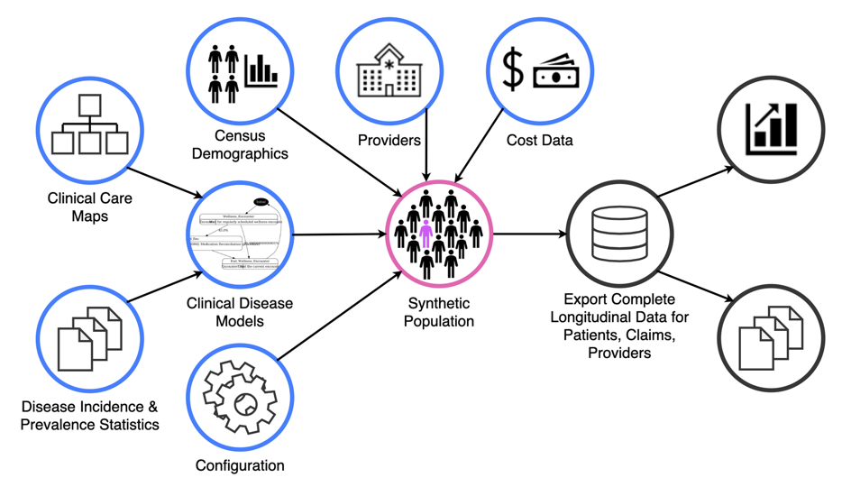

## Creation of Synthetic Patient Data 

You can use the [editor on GitHub](https://github.com/aebrower/synthetic_patient_data/edit/gh-pages/index.md) to maintain and preview the content for your website in Markdown files.

Whenever you commit to this repository, GitHub Pages will run [Jekyll](https://jekyllrb.com/) to rebuild the pages in your site, from the content in your Markdown files.

### Markdown

Markdown is a lightweight and easy-to-use syntax for styling your writing. It includes conventions for

```markdown
Syntax highlighted code block

# Header 1
## Header 2
### Header 3

- Bulleted
- List

1. Numbered
2. List

**Bold** and _Italic_ and `Code` text

[Link](url) and 
```

For more details see [Basic writing and formatting syntax](https://docs.github.com/en/github/writing-on-github/getting-started-with-writing-and-formatting-on-github/basic-writing-and-formatting-syntax).

### Jekyll Themes

Your Pages site will use the layout and styles from the Jekyll theme you have selected in your [repository settings](https://github.com/aebrower/synthetic_patient_data/settings/pages). The name of this theme is saved in the Jekyll `_config.yml` configuration file.

### Support or Contact

Having trouble with Pages? Check out our [documentation](https://docs.github.com/categories/github-pages-basics/) or [contact support](https://support.github.com/contact) and we’ll help you sort it out.

**Synthetic Data:** computationally derived from generative models to, **theoretically**, preserve statistical properties of the original data while protecting from privacy attacks

## Does it actually preserve statistical properties of the original data?
**Yes.** In most cases.
Studies have found that computationally derived (synthetic) data has no statistically significant difference from its original dataset.
The patterns presented and results derived from the two datasets are comparative.
However, if the original dataset does not contain a lot of data on a small, rural population, the information from the synthetic dataset is not relevant or useful.

## What are the major drawbacks of synthetic datasets?
- **Privacy-Utility Tradeoff:** information-rich datasets which are extremely valuable for statistical analyses always contain enough information to conduct privacy attacks
- If the synthetic dataset retains characteristics from the original dataset with high accuracy (this is what makes it so useful and relevant), it simultaneously enables adversaries to extract sensitive information about individuals.
- Hard to predict and decrease this risk
- Rare diseases that do not have much information are still hard to create in synthetic settings.

# What is Synthea?
It is a program created by MITRE to generate fully synthetic outputs about patients by accepting only publicly available information and health statistics as inputs.

**Goals of Synthea**
1. Data generation is based on models of clinical workflow and disease progression, so it can be easily modified and refined.
2. The temporal aspect of the model covers a synthetic patient’s entire lifetime instead of just a specific disease or condition.
3. Collaboration with experts from clinical and technical backgrounds supports the validity of the model.

## How does Synthea address the problems regarding synthetic datasets?
- Since the information Synthea uses to create its data is all publicly available, there is no privacy risk present.
- Due to its easily refinable nature, demographics of the population created by Synthea that do not match real demographics can be modified and refined easily by the creators with help from experts.
- Synthea models a patients’ entire lifetime rather than a singular encounter, so it can be parameterized in the future to take into account realistic interactions that define health systems (e.g. practices that deviate from standard guidelines and introduce variations in healthcare quality).

## How Synthea Works
Synthea begins by creating a synthetic population that health records will be created fo. This population is made entirely from publicly available data. 
Census demographics are used to create the makeup of the population, including race, age, gender and will affect things like how likely someone is to have a certain health condition. In addition to the census data, provider data is incorporated which includes things like hospitals and urgent cares. These providers affect the kind of treatment a patient is likely to receive and the cost. Finally, cost data is incorporated for different treatements, which depending on the demographics of the person and how much the treatment is, could potentially mean they will forgo a certain treatment if they aren't able to afford it.  

Once the synthetic population has been created, each patient will go through all of Synthea's modules. These modules assign a certain probability to how likely a patient is to get a certain condition with some modules being for more complex than others. 

Finally, when all of the setup has been completed the data can be exported into a variety of formats for your use. 



## Problems with Synthea

Despite Synthea addressing some problems with synthetic data it is still susceptible to certain issues. One of the big issues with Synthea is that it doesn't effectively model deviations in care. There are certain cases where a patient may not follow the normal progression of treatment, like if they can't afford the treatment or the physician just makes a decision to change course. At this point, Synthea is not able to effectively model these changes. As well, the quality of healthcare can vary widely between different providers, which is not incorporated into patient outcomes. This means that Synthea can deviate from actual expectations, and this issue  needs to be considered when you use Synthea. 

# How to use Synthea?
- Synthea is designed for non-clinical uses where access to real data is not mandatory. It's best used for creating innovative idea, education or testing where clinical data is needed
- Synthetic data sets are created from the command line where you can specify details about the data that you want to create

## Synthea requirements
To use Synthea, you will need:
- Java installed: https://www.java.com/en/
- To clone Synthea: 
```
  git clone https://github.com/synthetichealth/synthea.git
```

## Example case
To create synthetic health records for a population of size 10. Run the following command:
```
run_synthea -p 10
```
When this command runs each of the patients will run through the 72 modules and 76 submodules that are contained within Synthea. These module determine the health outcomes for the patients. Your output should look like the following:

```
Running with options:
Population: 10
Seed: 1651508269731
Provider Seed:1651508269731
Reference Time: 1651508269731
Location: Massachusetts
Min Age: 0
Max Age: 140
3 -- Alan320 Torphy630 (16 y/o M) Walpole, Massachusetts DECEASED
7 -- Antoine384 Emmerich580 (22 y/o M) Lexington, Massachusetts
6 -- Hong136 Kihn564 (45 y/o F) Boston, Massachusetts
1 -- Lloyd546 Cummings51 (60 y/o M) Saugus, Massachusetts
5 -- Kathlyn335 Pouros728 (59 y/o F) Attleboro, Massachusetts
2 -- Abraham100 Leannon79 (65 y/o M) Sudbury, Massachusetts
4 -- Christian753 Altenwerth646 (66 y/o M) Chelsea, Massachusetts
8 -- Darrell400 Shields502 (86 y/o M) Somerville, Massachusetts DECEASED
10 -- Kenneth671 Morar593 (0 y/o M) Boston, Massachusetts
9 -- Rocco842 Mohr916 (31 y/o M) Turners Falls, Massachusetts
3 -- Chance908 Runolfsson901 (58 y/o M) Walpole, Massachusetts
8 -- Genaro214 Volkman526 (66 y/o M) Somerville, Massachusetts DECEASED
8 -- Sidney996 Herman763 (93 y/o M) Somerville, Massachusetts
Records: total=13, alive=10, dead=3
```

Your specific outcome will vary between runs. However, by default 10 years of history for each patient from Massachusetts is created and written to the output files. All the data related to the patients are placed in their own JSON fille in the output/fhir folder. Also included by default is the output relating to the providers and hospitals that will potentially tend to patients. 


## Parameter options

### Output formats
A variety of formats can be created to fit your use case. You can create the output in CSV file which will create files including allergies.csv, providers.csv, medications.csv, patients.csv and encounters.csv among others.


The above outputs will be created when specify true for the exporter.csv.export parameter, like so:

```
run_synthea -p 10 --exporter.csv.export true
```


As well you can create easility readible outputs like this:
```
Lissette621 McCullough561
=========================
Race:                White
Ethnicity:           Non-Hispanic
Gender:              F
Age:                 3
Birth Date:          2018-10-08
Marital Status:      S
--------------------------------------------------------------------------------
ALLERGIES:
No Known Allergies
--------------------------------------------------------------------------------
MEDICATIONS:
  2020-08-28[STOPPED] : Ibuprofen 100 MG Oral Tablet
  2020-08-28[STOPPED] : Amoxicillin 500 MG Oral Tablet
--------------------------------------------------------------------------------
CONDITIONS:
  2021-10-07 - 2021-10-07 : Febrile neutropenia (disorder)
  2021-10-07 - 2021-10-07 : Acute myeloid leukemia, disease (disorder)
  2020-08-28 - 2020-09-11 : Otitis media
--------------------------------------------------------------------------------
CARE PLANS:
--------------------------------------------------------------------------------
REPORTS:
  2018-10-08 : Complete blood count (hemogram) panel - Blood by Automated count
           - Leukocytes [#/volume] in Blood by Automated count 7.7 10*3/uL
           - Erythrocytes [#/volume] in Blood by Automated count 4.9 10*6/uL
           - Hemoglobin [Mass/volume] in Blood        14.1 g/dL
           - Hematocrit [Volume Fraction] of Blood by Automated count 47.1 %
--------------------------------------------------------------------------------
OBSERVATIONS:
  2022-03-14 : Tobacco smoking status NHIS              Never smoker
  2022-03-14 : Respiratory rate                         12.0 /min
  2022-03-14 : Heart rate                               75.0 /min
  2022-03-14 : Blood Pressure
           - Diastolic Blood Pressure                 81.0 mm[Hg]
           - Systolic Blood Pressure                  113.0 mm[Hg]
  2022-03-14 : Body mass index (BMI) [Percentile] Per age and gender 75.2 %
  2022-03-14 : Body Mass Index                          16.4 kg/m2
  2022-03-14 : Head Occipital-frontal circumference     45.6 cm
  2022-03-14 : Weight-for-length Per age and sex        44.1 %
  2022-03-14 : Body Weight                              13.1 kg
  2022-03-14 : Pain severity - 0-10 verbal numeric rating [Score] - Reported 0.0 {score}
  2022-03-14 : Body Height                              89.5 cm
  2021-10-07 : Body Temperature                         102.1 [degF]

--------------------------------------------------------------------------------
PROCEDURES:
  2022-03-14 : Medication Reconciliation (procedure)
  2021-10-07 : Transfer to stepdown for Acute myeloid leukemia, disease (disorder)
  2021-10-07 : Chemotherapy (procedure) for Acute myeloid leukemia, disease (disorder)
  2021-09-13 : Medication Reconciliation (procedure)
  2019-12-16 : Medication Reconciliation (procedure)
  2019-01-14 : Medication Reconciliation (procedure)
--------------------------------------------------------------------------------
IMMUNIZATIONS:
  2021-09-13 : Influenza, seasonal, injectable, preservative free
  2021-03-15 : Hep A, ped/adol, 2 dose
  2020-09-14 : Influenza, seasonal, injectable, preservative free
--------------------------------------------------------------------------------

```
This output is created when the exporter.text.export paramter is true.

As well, specific clinical formats, which can be useful for testing software that will be dealing with clinical data, can be outputed like CPCDS and C-CDA.

### Patient related paramters
Beyond just output formats, a number of paramters can be specified to get the patient information that you need. 
- gender, e.g. -g M
- age, e.g. -a 60-65
- include local modules with the localModulesDirPath, -d

As well, beyond the specific command line parameters, you can specify which patients that you want to keep by including a JSON file. This can limit to something like just keeping patients that have had breast cancer. This file should be included using the -k paramter.


